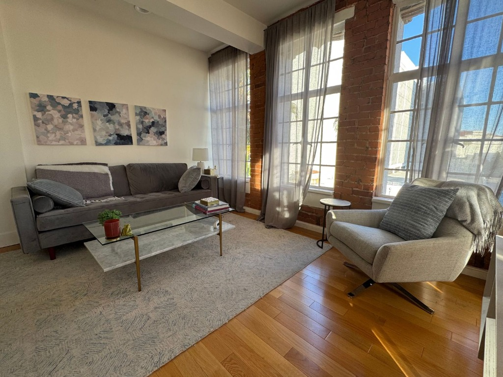
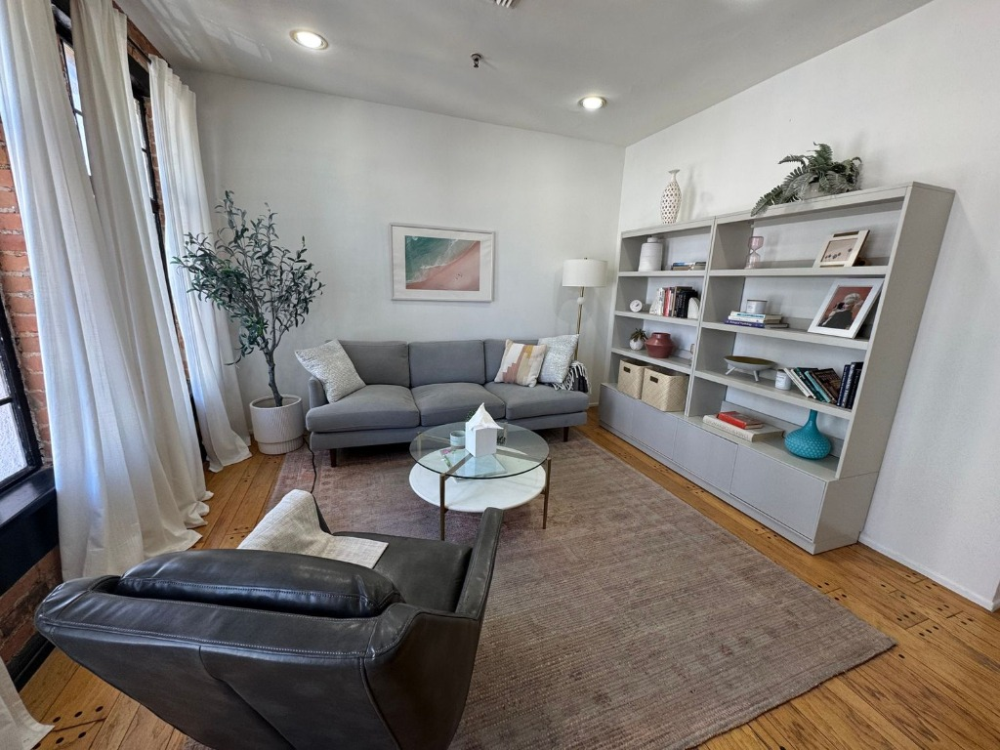

# Dr. Maya Reynolds, PsyD — Clinical Psychology Web Application

A responsive, accessible Next.js web application designed for Dr. Maya Reynolds, PsyD, a Licensed Clinical Psychologist based in Santa Monica, CA. Built with Next.js 14 (App Router), TypeScript, Tailwind CSS, and Lucide Icons.

---

## Live Demo

- 🌐 **Live Website**: [https://dr-maya-reynolds-therapy.vercel.app](https://dr-maya-reynolds-therapy.vercel.app) *(Replace with your Vercel URL)*
- 🎥 **Demo Walkthrough Video**: [Loom Video Link](https://www.loom.com/share/your-loom-link-here)
- 🐙 **GitHub Repository**: [https://github.com/your-username/dr-maya-reynolds-therapy](https://github.com/your-username/dr-maya-reynolds-therapy)

---

## Project Overview

This application serves as a digital homepage and practice directory for Dr. Maya Reynolds, PsyD. It presents structured clinical information—including therapy specialties (Anxiety, Trauma & EMDR, Professional Burnout), practice modalities, physical office details, and consultation booking—within a calming, high-trust user interface.

- **Primary Goal**: Convert prospective therapy clients by establishing immediate trust, highlighting evidence-based credentials, and clarifying in-person Santa Monica office and California telehealth options.
- **Target Audience**: High-achieving adults, working professionals, and creatives in Santa Monica and across California seeking specialized clinical psychology care.

---

## Assignment Objective

The objective of this engineering implementation was to synthesize structural layout patterns with authentic clinical profile copy, delivering a production-ready application that adheres to modern web standards for responsiveness, accessibility, performance, and UI polish.

---

## Key Features

- **Responsive Design System**: Custom fluid layout using Tailwind CSS, scaling seamlessly across mobile, tablet, laptop, and ultrawide viewports (320px – 1920px+).
- **Interactive Mobile Navigation**: Slide drawer navigation with backdrop blur, body scroll lock, and keyboard accessibility.
- **Our Office Sanctuary Showcase**: Section highlighting physical office amenities at `123th Street 45 W, Santa Monica, CA 90401` with high-resolution imagery and practice highlights.
- **Interactive FAQ Accordion**: Keyboard-accessible accordion with ARIA attributes and smooth icon rotation.
- **Consultation Request Modal**: Accessible modal overlay (`role="dialog"`, `aria-modal="true"`) supporting `Escape` key dismissal and responsive input scaling.
- **Local SEO & Schema.org Structured Data**: Integrated `MedicalBusiness` JSON-LD schema, open graph metadata, `sitemap.xml`, and `robots.txt`.
- **High-Contrast Dark Glassmorphic Credentials**: Overlaid credential cards ensuring high contrast and legibility over imagery.

---

## Responsive Support

The user interface has been optimized for the following viewports:

- **Mobile**: 320px, 360px, 375px, 390px, 414px, 430px, 480px, 540px
- **Tablet**: 768px, 820px, 912px, 1024px
- **Desktop & Laptop**: 1280px, 1440px, 1536px, 1728px, 1920px+

Layouts utilize fluid typography, responsive grid columns (`1 col` on mobile, `2 col` on tablet, `3–4 col` on desktop), and dynamic max-width containers.

---

## Technology Stack

| Category | Technology | Usage / Purpose |
| :--- | :--- | :--- |
| **Framework** | Next.js 14 (App Router) | React framework for static page generation & SSR |
| **Language** | TypeScript | Strict typing for components, props, and data models |
| **Styling** | Tailwind CSS | Utility-first CSS framework for responsive layout system |
| **Icons** | Lucide React | Lightweight SVG icons |
| **Fonts** | Next.js Font (`next/font`) | Google Fonts optimization (`Cormorant Garamond` & `Plus Jakarta Sans`) |
| **Deployment** | Vercel | Production hosting & edge CDN distribution |

---

## Project Structure

```text
dr-maya-reynolds-therapy/
├── public/
│   └── images/               # HD practice photos and headshots
│       ├── dr-maya-reynolds.jpg
│       ├── dr-maya-reynolds.png
│       ├── office-1.jpg
│       ├── office-2.jpg
│       └── office-gallery.png
├── src/
│   ├── app/
│   │   ├── globals.css        # Global CSS, font variables & reduced-motion rules
│   │   ├── layout.tsx         # Root layout with font imports & JSON-LD schema
│   │   ├── page.tsx           # Home page component assembling all sections
│   │   ├── robots.ts          # Dynamic robots.txt route
│   │   └── sitemap.ts         # Dynamic sitemap.xml route
│   ├── components/
│   │   ├── layout/
│   │   │   ├── Footer.tsx     # Practice footer with links & clinical disclaimer
│   │   │   └── Navbar.tsx     # Top trust bar & desktop/mobile navigation
│   │   ├── modals/
│   │   │   └── ConsultationModal.tsx # Accessible consultation request modal
│   │   ├── sections/
│   │   │   ├── AboutSection.tsx      # Bio & clinical philosophy section
│   │   │   ├── ApproachSection.tsx   # Modalities grid (EMDR, CBT, Somatic)
│   │   │   ├── CTASection.tsx        # Consultation booking call-to-action
│   │   │   ├── FAQSection.tsx        # Practice FAQ accordion
│   │   │   ├── HeroSection.tsx       # Above-the-fold hero with headshot
│   │   │   ├── OfficeSection.tsx     # Physical Santa Monica office showcase
│   │   │   ├── ServicesSection.tsx   # Clinical specialties card grid
│   │   │   └── TrustBanner.tsx       # Credential trust bar
│   │   └── ui/
│   │       ├── Badge.tsx             # Standardized pill badges
│   │       ├── Button.tsx            # Button component with 48px touch targets
│   │       ├── Card.tsx              # Card container with standard shadows
│   │       └── SectionHeading.tsx    # Section title & subtitle wrapper
│   ├── config/
│   │   ├── siteConfig.ts      # Site metadata & navigation links
│   │   └── therapistProfile.ts# Authoritative therapist data & bio copy
│   └── lib/
│       ├── schema.ts          # Schema.org MedicalBusiness JSON-LD generator
│       └── utils.ts           # Utility functions (clsx, tailwind-merge)
├── .eslintrc.json
├── .gitignore
├── next.config.mjs
├── package.json
├── postcss.config.js
├── README.md
├── tailwind.config.ts
├── tsconfig.json
└── vercel.json
```

---

## Performance Optimizations

- **Static Generation (SSG)**: All main routes are pre-rendered into static HTML during build time (`next build`).
- **Cumulative Layout Shift (CLS) Prevention**: Image wrappers enforce reserved aspect ratios (`aspect-[3/4]`, `aspect-[4/3]`) to eliminate reflow.
- **Image Optimization**: Priority loading enabled on hero headshots (`priority`, `sizes="(max-width: 768px) 100vw, 500px"`).
- **Reduced Bundle Footprint**: Zero heavy external state libraries; relies on native React Hooks (`useState`, `useEffect`).

---

## Accessibility (WCAG 2.1 AA Compliance)

- **Semantic HTML**: Proper use of `<header>`, `<main>`, `<nav>`, `<section>`, `<article>`, and `<footer>` elements.
- **Keyboard Navigation**: Interactive elements (buttons, inputs, accordion headers) support focus outlines (`focus-visible:ring-2 focus-visible:ring-sage-700`).
- **Touch Targets**: Minimum **48px × 48px** touch target dimensions enforced across all buttons and inputs.
- **ARIA Integration**: Accordion controls utilize `aria-expanded` and `aria-controls`; modals use `role="dialog"` and `aria-modal="true"`.
- **Reduced Motion**: Prefers-reduced-motion media query overrides animations for users who prefer minimal motion.

---

## Local Installation & Setup

### Prerequisites
- Node.js 18.x or higher
- npm 9.x or higher

### Steps

1. **Clone the repository**:
   ```bash
   git clone https://github.com/your-username/dr-maya-reynolds-therapy.git
   cd dr-maya-reynolds-therapy
   ```

2. **Install dependencies**:
   ```bash
   npm install
   ```

3. **Run the development server**:
   ```bash
   npm run dev
   ```
   Open [http://localhost:3000](http://localhost:3000) in your browser.

4. **Build for production**:
   ```bash
   npm run build
   ```

5. **Start production build locally**:
   ```bash
   npm start
   ```

---

## Deployment

This application is ready for zero-configuration deployment on **Vercel**:

1. Push your code to GitHub.
2. Import the repository into your Vercel Dashboard.
3. Vercel automatically detects Next.js 14 settings.
4. Click **Deploy**.

- **Deployment Link**: `https://dr-maya-reynolds-therapy.vercel.app`

---

## Screenshots

| Desktop Homepage | Mobile Viewport |
| :---: | :---: |
|  |  |

| Services Grid | Office Sanctuary |
| :---: | :---: |
|  |  |

---

## Demo Walkthrough Video

For a detailed 5-minute technical walkthrough covering responsive layout execution, accessibility audits, and clinical positioning, watch the Loom video below:

👉 [Watch 5-Minute Technical Pitch & Walkthrough on Loom](https://www.loom.com/share/your-loom-link-here)

---

## Key Design Decisions

- **Eucalyptus Sage & Coastal Terracotta Palette**: Selected to communicate clinical calm (`#2C4A3E`) paired with warm human approachable accents (`#C47A5A`).
- **Typography Pairing**: `Cormorant Garamond` serif for editorial, high-trust headings; `Plus Jakarta Sans` for legible body text.
- **High-Contrast Overlays**: Dark glassmorphic badges (`bg-slate-900/90 backdrop-blur-md text-white`) ensure text passes contrast checks when overlaid on images.

---

## Future Enhancements

- **Online Booking System Integration**: Direct integration with SimplePractice or Alma calendar widgets.
- **Client Portal Authentication**: Secure login portal for existing clients to complete intake forms.
- **CMS Integration**: Headless CMS integration (Sanity or Contentful) for dynamic blog and article publishing.

---

## License

This project is open-source and available under the [MIT License](LICENSE).

---

## Contact & Author

- **Name**: Vidya Sagar
- **LinkedIn**: [linkedin.com/in/your-profile](https://linkedin.com/in/your-profile)
- **GitHub**: [github.com/your-username](https://github.com/your-username)
- **Email**: your.email@example.com
